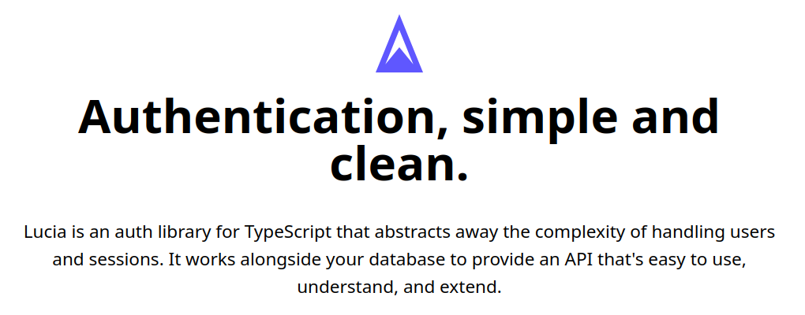

I am using these aliases and oh my zsh.

<a href="https://ohmyz.sh/" target="_blank">https://ohmyz.sh/</a>

`.zshrc`

```bash
alias pi='pnpm install'
alias pa='pnpm add'
alias px="pnpm dlx"
```

## 1.0 Getting Started in SvelteKit

<a href="https://lucia-auth.com/getting-started/sveltekit" target="_blank">https://lucia-auth.com/getting-started/sveltekit</a>

Install Lucia using your package manager of your choice.

`pa lucia`

### 1.1 Initialize Lucia

<a href="https://lucia-auth.com/getting-started/sveltekit#initialize-lucia" target="_blank">https://lucia-auth.com/getting-started/sveltekit#initialize-lucia</a>

Import lucia() from lucia and initialize it in its own module (file). Export auth and its type as Auth. Make sure to pass the sveltekit() middleware. We also need to provide an adapter but since it’ll be specific to the database you’re using, we’ll cover that in the next section.

**src/lib/server/lucia.ts**

```ts
import { lucia } from 'lucia';
import { sveltekit } from 'lucia/middleware';
import { dev } from '$app/environment';

// expect error (see next section)
export const auth = lucia({
	env: dev ? 'DEV' : 'PROD',
	middleware: sveltekit()
});

export type Auth = typeof auth;
```

### 1.2 Setup your database

<a href="https://lucia-auth.com/getting-started/sveltekit#setup-your-database" target="_blank">https://lucia-auth.com/getting-started/sveltekit#setup-your-database</a>

Lucia uses adapters to connect to your database. We provide official adapters for a wide range of database options, but you can always create your own. The schema and usage are described in each adapter’s documentation. The example below is for the **Prisma adapter**.

**src/lib/server/lucia.ts**

```ts
import { lucia } from 'lucia';
import { sveltekit } from 'lucia/middleware';
import { dev } from '$app/environment';
import { prisma } from '@lucia-auth/adapter-prisma';
import { PrismaClient } from '@prisma/client';

const client = new PrismaClient();

export const auth = lucia({
	env: dev ? 'DEV' : 'PROD',
	middleware: sveltekit(),
	adapter: prisma(client)
});

export type Auth = typeof auth;
```

#### 1.2.1 Prisma adapter

<a href="https://lucia-auth.com/database-adapters/prisma" target="_blank">https://lucia-auth.com/database-adapters/prisma</a>

#### 1.2.2 Add Prisma to SvelteKit

Add the Prisma extension to VS Code.

Extension Id `Prisma.prisma`

<a href="https://marketplace.visualstudio.com/items?itemName=Prisma.prisma" target="_blank">https://marketplace.visualstudio.com/items?itemName=Prisma.prisma</a>

Add the settings for the Prisma extension in your `settings.json`.

```json
"[prisma]": {
  "editor.defaultFormatter": "Prisma.prisma",
  "editor.formatOnSave": true
},
```

Install the Prisma CLI as a development dependency in the project.

<a href="https://www.prisma.io/docs/reference/api-reference/command-reference#installation" target="_blank">https://www.prisma.io/docs/reference/api-reference/command-reference#installation</a>

<a href="https://pnpm.io/cli/install#--dev--d" target="_blank">https://pnpm.io/cli/install#--dev--d</a>

<a href="https://www.prisma.io/docs/reference/api-reference/command-reference#pnpm" target="_blank">https://www.prisma.io/docs/reference/api-reference/command-reference#pnpm</a>

`pi prisma -D`

```bash
Packages: +2
++
Progress: resolved 246, reused 222, downloaded 2, added 2, done
node_modules/.pnpm/@prisma+engines@5.2.0/node_modules/@prisma/engines: Running postinstall script, done in 398ms
node_modules/.pnpm/prisma@5.2.0/node_modules/prisma: Running preinstall script, done in 70ms

devDependencies:
+ prisma 5.2.0

Done in 9.5s
```

#### 1.2.3 Set up Prisma

Set up Prisma with the init command of the Prisma CLI and choose `sqlite` as database.

<a href="https://www.prisma.io/docs/reference/api-reference/command-reference#pnpm-1" target="_blank">https://www.prisma.io/docs/reference/api-reference/command-reference#pnpm-1</a>

`px prisma init --datasource-provider sqlite`

```bash
Packages: +2
++
Progress: resolved 2, reused 2, downloaded 0, added 2, done

✔ Your Prisma schema was created at prisma/schema.prisma
  You can now open it in your favorite editor.

warn You already have a .gitignore file. Don't forget to add `.env` in it to not commit any private information.

Next steps:
1. Set the DATABASE_URL in the .env file to point to your existing database. If your database has no tables yet, read https://pris.ly/d/getting-started
2. Run prisma db pull to turn your database schema into a Prisma schema.
3. Run prisma generate to generate the Prisma Client. You can then start querying your database.

More information in our documentation:
https://pris.ly/d/getting-started
```

#### 1.2.4 Set up Prisma schema

<a href="https://lucia-auth.com/database-adapters/prisma#prisma-schema" target="_blank">https://lucia-auth.com/database-adapters/prisma#prisma-schema</a>

Add Prisma schema for default Lucia values.

**prisma/schema.prisma**

```prisma
// This is your Prisma schema file,
// learn more about it in the docs: https://pris.ly/d/prisma-schema

generator client {
  provider = "prisma-client-js"
}

datasource db {
  provider = "sqlite"
  url      = env("DATABASE_URL")
}

// https://lucia-auth.com/database-adapters/prisma#prisma-schema
model User {
  id           String    @id @unique
  auth_session Session[]
  key          Key[]
}

model Key {
  id              String  @id @unique
  hashed_password String?
  user_id         String
  user            User    @relation(references: [id], fields: [user_id], onDelete: Cascade)

  @@index([user_id])
}

model Session {
  id             String @id @unique
  user_id        String
  active_expires BigInt
  idle_expires   BigInt
  user           User   @relation(references: [id], fields: [user_id], onDelete: Cascade)

  @@index([user_id])
}

```

#### 1.2.5 Install Lucia database adapter Prisma

<a href="https://lucia-auth.com/database-adapters/prisma#installation" target="_blank">https://lucia-auth.com/database-adapters/prisma#installation</a>

`pa @lucia-auth/adapter-prisma`

```bash
Packages: +3
+++
Progress: resolved 249, reused 227, downloaded 0, added 3, done
node_modules/.pnpm/@prisma+client@5.2.0_prisma@5.2.0/node_modules/@prisma/client: Running postinstall script, done in 2.5s

dependencies:
+ @lucia-auth/adapter-prisma 3.0.1

Done in 5.2s
```

#### 1.2.6 Add default values to lucia.ts

<a href="https://lucia-auth.com/database-adapters/prisma#usage" target="_blank">https://lucia-auth.com/database-adapters/prisma#usage</a>

**src/lib/server/lucia.ts**

```ts
import { lucia } from 'lucia';
import { sveltekit } from 'lucia/middleware';
import { dev } from '$app/environment';
import { prisma } from '@lucia-auth/adapter-prisma';
import { PrismaClient } from '@prisma/client';

const client = new PrismaClient();

export const auth = lucia({
	env: dev ? 'DEV' : 'PROD',
	middleware: sveltekit(),
	adapter: prisma(client, {
		user: 'user', // model User {}
		key: 'key', // model Key {}
		session: 'session' // model Session {}
	})
});

export type Auth = typeof auth;
```

### 1.3 Set up types

<a href="https://lucia-auth.com/getting-started/sveltekit#set-up-types" target="_blank">https://lucia-auth.com/getting-started/sveltekit#set-up-types</a>

**src/app.d.ts**

In your `src/app.d.ts` file, declare a `Lucia` namespace. The import path for `Auth` is where you initialized `lucia()`.

```ts
// See https://kit.svelte.dev/docs/types#app
// for information about these interfaces

// https://lucia-auth.com/getting-started/sveltekit#set-up-types
declare global {
	namespace App {
		// interface Error {}
		interface Locals {
			auth: import('lucia').AuthRequest;
		}
		// interface PageData {}
		// interface Platform {}
	}
}

/// <reference types="lucia" />
declare global {
	namespace Lucia {
		type Auth = import('$lib/server/lucia').Auth;
		type DatabaseUserAttributes = {};
		type DatabaseSessionAttributes = {};
	}
}

export {};
```

### 1.4 Set up hooks

<a href="https://lucia-auth.com/getting-started/sveltekit#set-up-hooks" target="_blank">https://lucia-auth.com/getting-started/sveltekit#set-up-hooks</a>

This is optional but highly recommended. Create a new `handle()` hook that stores `AuthRequest` to `locals.auth`.

**src/hooks.server.ts**

```ts
import { auth } from '$lib/server/lucia';
import type { Handle } from '@sveltejs/kit';

export const handle: Handle = async ({ event, resolve }) => {
	// we can pass `event` because we used the SvelteKit middleware
	event.locals.auth = auth.handleRequest(event);
	return await resolve(event);
};
```

## 2.0 Sign in with username and password using adapter Prisma and Sqlite

<a href="https://lucia-auth.com/basics/database#database-model" target="_blank">https://lucia-auth.com/basics/database#database-model</a>

Lucia requires 3 tables to work, which are then connected to Lucia via a database adapter.

**User** table <a href="https://lucia-auth.com/basics/database#user-table" target="_blank">https://lucia-auth.com/basics/database#user-table</a>
**Session** table <a href="https://lucia-auth.com/basics/database#session-table" target="_blank">https://lucia-auth.com/basics/database#session-table</a>
**Key** table <a href="https://lucia-auth.com/basics/database#key-table" target="_blank">https://lucia-auth.com/basics/database#key-table</a>

### 2.1 Update your database

To sign in with a **username** we need to add an `username` field to the `User` table.

<a href="https://lucia-auth.com/guidebook/sign-in-with-username-and-password/sveltekit#update-your-database" target="_blank">https://lucia-auth.com/guidebook/sign-in-with-username-and-password/sveltekit#update-your-database</a>

**prisma/schema.prisma**

```ts
model User {
  id        String @id @unique
  username  String @unique		<== add the username field to the User table
  image_url String @default("")

  auth_session Session[]
  auth_key     Key[]
  tweets       Tweet[]
  followed_by  Follows[] @relation("following")
  following    Follows[] @relation("follower")
}
```

### 2.2 Update your types

Declare the type of each field you add in the `Lucia.DatabaseUserAttributes`.

**src/app.d.ts**

```ts
// See https://kit.svelte.dev/docs/types#app
// for information about these interfaces

// https://lucia-auth.com/getting-started/sveltekit#set-up-types
declare global {
	namespace App {
		// interface Error {}
		interface Locals {
			auth: import('lucia').AuthRequest;
		}
		// interface PageData {}
		// interface Platform {}
	}
}

/// <reference types="lucia" />
declare global {
	namespace Lucia {
		type Auth = import('$lib/server/lucia').Auth;
		type DatabaseUserAttributes = {
			// required fields (i.e. id) should not be defined here
			username: string;		<== add the username type to the DatabaseUserAttributes type
		};
		type DatabaseSessionAttributes = {};
	}
}

export {};
```

At this point, you have a Prisma schema but no database yet!!

<a href="https://www.prisma.io/docs/getting-started/quickstart#3-run-a-migration-to-create-your-database-tables-with-prisma-migrate" target="_blank">https://www.prisma.io/docs/getting-started/quickstart#3-run-a-migration-to-create-your-database-tables-with-prisma-migrate</a>

Run the following command in your terminal to create the SQLite database and the _User_, _Key_ and _Session_ tables represented by your models defined in **1.2.4 Set up Prisma schema** and updated in **2.1 Update your database**.

`px prisma migrate dev --name init`

This command did two things.

1. It creates a new SQL migration file for this migration in the prisma/migrations directory.
2. It runs the SQL migration file against the database.

Because the SQLite database file didn't exist before, the command also created it inside the prisma directory with the name `dev.db` as defined via the environment variable in the `.env` file.

```bash
Packages: +2
++
Progress: resolved 2, reused 2, downloaded 0, added 2, done
Environment variables loaded from .env
Prisma schema loaded from prisma/schema.prisma
Datasource "db": SQLite database "dev.db" at "file:./dev.db"

SQLite database dev.db created at file:./dev.db

Applying migration `20230908214956_init`

The following migration(s) have been created and applied from new schema changes:

migrations/
  └─ 20230908214956_init/
    └─ migration.sql

Your database is now in sync with your schema.

✔ Generated Prisma Client (v5.2.0) to ./node_modules/.pnpm/@prisma+client@5.2.0_prisma@5.2.0/node_modules/@prisma/client in 102ms
```

Congratulations, you now have your database and tables ready.

Let's go and learn how you can send some queries to read and write data!

### 2.3 Configure Lucia

We’ll expose the user’s `username` to the `User` object by defining `getUserAttributes`.

<a href="https://lucia-auth.com/basics/configuration#getuserattributes" target="_blank">https://lucia-auth.com/basics/configuration#getuserattributes</a>

```ts
import { lucia } from 'lucia';
import { sveltekit } from 'lucia/middleware';
import { dev } from '$app/environment';
import { prisma } from '@lucia-auth/adapter-prisma';
import { PrismaClient } from '@prisma/client';

const client = new PrismaClient();

export const auth = lucia({
	env: dev ? 'DEV' : 'PROD',
	middleware: sveltekit(),
	adapter: prisma(client, {
		user: 'user', // model User {}
		key: 'key', // model Key {}
		session: 'session' // model Session {}
	}),
	// Generate user attributes for the user.
	getUserAttributes: (data) => {
		return {
			username: data.username
		};
	}
});

export type Auth = typeof auth;
```

### 3.0 Create a sign up page

To create users we need a form that sends `username` and `password` values to our database.

Create a `signup` route.

**src/routes/signup/+page.svelte**

```html
<script lang="ts">
	import { enhance } from '$app/forms';
</script>

<h1>Sign up</h1>
<form method="post" use:enhance>
	<label for="username">Username</label>
	<input name="username" id="username" /><br />
	<label for="password">Password</label>
	<input type="password" name="password" id="password" /><br />
	<input type="submit" />
</form>

<a href="/">Home</a>
```

Link to the `signup` route from the `index` page.

**src/routes/+page.svelte**

```html
<h1>Welcome to SvelteKit</h1>
<p>Visit <a href="https://kit.svelte.dev">kit.svelte.dev</a> to read the documentation</p>

<a href="/signup">signup</a>
```
